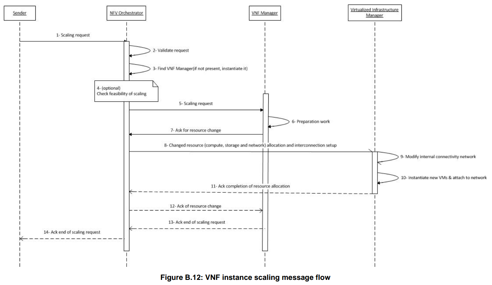
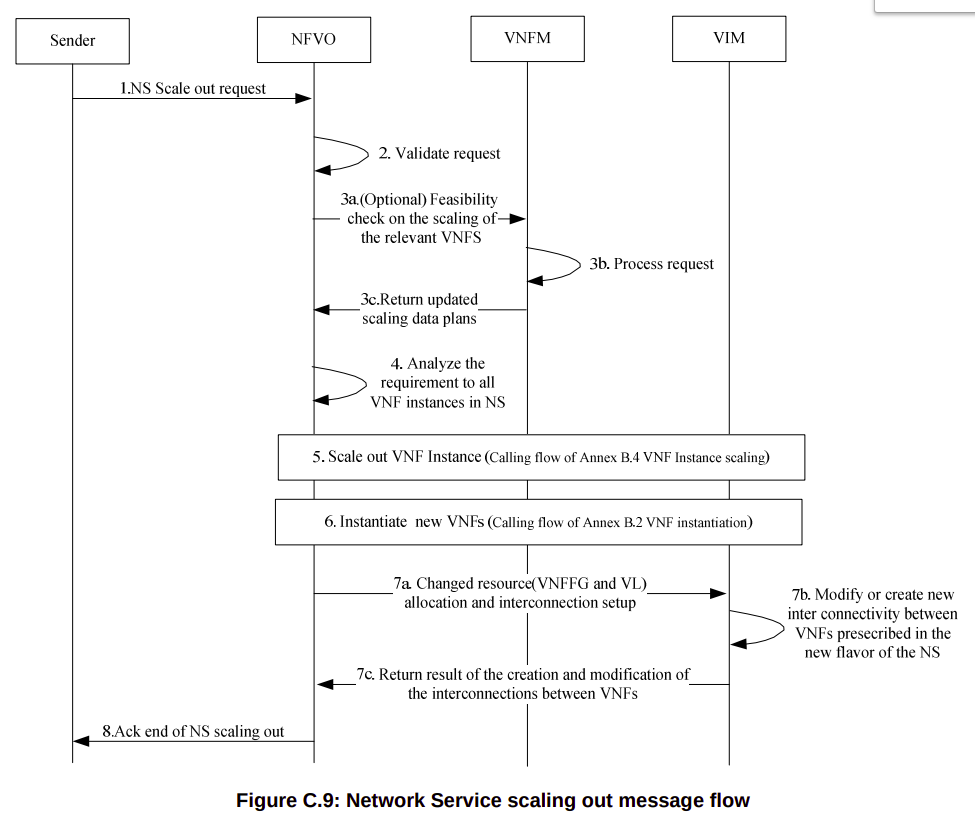

# Log related to article of causality

## 01/April/20

### Problems or triggers for reconfiguration
- Triggers
	- Energy consumption: 
		- An Energy-aware Service Function Chaining and Reconfiguration Algorithm in NFV [source](https://ieeexplore.ieee.org/abstract/document/7789440)
		- Migration Energy Aware Reconfigurations of Virtual Network Function Instances in NFV Architectures [source](https://ieeexplore.ieee.org/document/7883907)
	- Higher Revenues
		- Reconfiguration of Cloud and Bandwidth Resources in NFV Architectures Based on Segment Routing Control/Data Plane [source](https://ieeexplore.ieee.org/abstract/document/8840406/)
		- On Fast Slice Reconfiguration [source](https://ieeexplore.ieee.org/document/8648117)
	- Reduce costs
		- Proposal and Investigation of an Optical Reconfiguration Cost Aware Policy for Resource Allocation in Network Function Virtualization Infrastructures [source](https://ieeexplore.ieee.org/abstract/document/8732437)
		- Be Scalable and Rescue My Slices During Reconfiguration [source](https://hal.inria.fr/hal-02416096/document)
	- New Virtual Network Request
		- Reconfiguration of Virtual Network Mapping Considering Service Disruption [source](https://ieeexplore.ieee.org/document/6655090)
	- Improve performance of critical services
		- Coupling VNF Orchestration and SDN Virtual Network Reconfiguration[source](https://www.researchgate.net/publication/336257419_Coupling_VNF_Orchestration_and_SDN_Virtual_Network_Reconfiguration)
	- Fault tolerance 
		- Algorithms for Fault-Tolerant Placement of Stateful Virtualized Network Functions [source](https://ieeexplore.ieee.org/document/8422444)
	- Improve QoS: 
		- On Dynamic Service Function Chain Deployment and Readjustment [source](https://ieeexplore.ieee.org/document/7938396)
		- Reconfiguration de chaınes de fonctions de services sans interruption [source](https://hal.archives-ouvertes.fr/hal-02118989/file/AlgoTel.pdf)
		- On Fast Slice Reconfiguration [source](https://ieeexplore.ieee.org/document/8648117)
	- Changing loads:
		- On the Cost-Optimality Trade-off for Service Function Chain Reconfiguration [source](https://arxiv.org/abs/1910.01881)

## 02/April/20

### Network service operations [source](https://www.etsi.org/deliver/etsi_gr/NFV-REL/001_099/010/03.01.01_60/gr_NFV-REL010v030101p.pdf) ###

- Resilency Operations:
	- **Scaling**, i.e. the dynamic provisioning or deprovisioning of resources granted to VNFs;
		- violation of the forwarding graph dependencies in one (or several) VNF(s) of the network service;
		- violation of the dependencies in a nested network service (e.g. how two nested NSs are linked to each other);
		- unprotected new network service instance (e.g. failure to scale out a new pair of VNFs);
		- malfunction of old/new network service instance; etc.
		- In case the composite network service NS2 shown in Figure 6.1 has to be scaled out, if the two composite network services NS1 and NS2 do not have the same priority (e.g. one of them is more critical than the other), the higher priority composite network service needs to be served first, i.e. the scaling out process will start with its VNFs.
 	- **Migration**, i.e. the move of virtualised resources from one set of physical resources to another;
 		- maintenance purposes, e.g. NFVI software/hardware modification, servers addition/removal;
 		- service restoration following failures;
 		-  failure prevention through a deep analysis of appropriate KPIs.
 		- As a result of such a process "live migration" still may cause a detectable interruption of the VM which could
create inconsistency in the VNF if not considered and handled properly.
	 - **Restoration** following failures if resources are available;
	 	- hardware/software failures among the compute/storage resources;
	 	- loss of connectivity both locally or in a wide-area perimeter;
	 	- overload due to unusual high traffic demand (caused by a legitimate event or attacks);
	 	- failure of scaling or migration processes;
	 	- system misconfiguration;
	 	-  if several network service instances chained together are impacted by the failure, some particular instances may need to be restored before others if sequential constraints are present;
	 	- if both shared network service(s) and dedicated network service(s) are impacted by the failure, VNFs composing the shared network service(s) have to be restored first to minimize the global service unavailability;
		- if both shared network service(s) and dedicated network service(s) are impacted by the failure, VNFs composing the shared network service(s) have to be restored first to minimize the global service unavailability;
		- Handling of the restoration procedures has to take into consideration the NS instance priority attribute, therefore NFVO would prioritize accordingly the restoration of NS instances that have different levels of priority.
	 - **Resource reallocation**, i.e. restoration if the desired resources are insufficient.

### Term definition [source](https://www.etsi.org/deliver/etsi_gs/NFV/001_099/003/01.04.01_60/gs_NFV003v010401p.pdf)
- Terms
 	- **Dedicated network service:** nested network service which is only part of a single composite network service
	 - **Shared network service:** nested network service which is shared by two (or more) composite network services
 
### Network Service LCM operations [source](https://docbox.etsi.org/ISG/NFV/Open/Publications_pdf/Specs-Reports/NFV-IFA%20030v3.3.1%20-%20GS%20-%20Multi%20Domain%20MANO%20-%20spec.pdf)
- Operations 
	- **Create NS Identifier** 
	- **Delete NS Identifier**
	- **Instantiate NS**
	- Terminate NS 
	- Scale NS
	- Heal NS
	- **Query NS**
	- Subscription/Notification
	- **Get Operation Status**

Note: Operations in **bold** are the ones which do not need a grant from another orchestrator in case of multiple orchestrators [source](https://www.etsi.org/deliver/etsi_gs/NFV-SOL/001_099/011/03.03.01_60/gs_NFV-SOL011v030301p.pdf)

		
## 03/April/20
Nothing

## 04/April 20

### Definitions
**Administrative domain**: collection of systems and networks operated by a single organization or administrative authority [source](https://www.etsi.org/deliver/etsi_gs/NFV-IFA/001_099/010/02.01.01_60/gs_nfv-ifa010v020101p.pdf)

**VNF Lifecycle Operation Granting:** permission to perform a VNF lifecycle management operation and the resource management operations necessary to complete it, if any apply. [source](https://www.etsi.org/deliver/etsi_gs/NFV-IFA/001_099/010/02.01.01_60/gs_nfv-ifa010v020101p.pdf)

### Use case:  Network Services provided using multiple administrative domains [source](https://www.etsi.org/deliver/etsi_gr/NFV-IFA/001_099/028/03.01.01_60/gr_NFV-IFA028v030101p.pdf)

**Definition:** This use case describes a network operator offering Network Services (NS) to different departments within the same operator, as well as facilitating the offering of these NSs to another network operator. The use case considers a single NFVO per administrative domain.

Figure 1. Composite NS and nested NSs example. In this example, the two constituent nested NSs which build up the composite NS are offered by administrative domains different than the one offering the composite NS itself.

Figure 2. NSs hierarchy provided using multiple administrative domains.

#### NFVO-Roles

A single NFVO can play both provider consumer role. The VNFMs in each administrative domain interact with the NFVO (either NFVO-1 or NFVO-2) of the same administrative domain. NFVO-1 is not aware of the constituent VNF instances of the nested NS instance, and hence NFVO-1 does not interact with the VNFMs in the administrative domain of NFVO-2.

#### Composite NS scaling in sharing scenario

 On-boarding flows are asynchronous: i.e. no timing constraints exist between two consecutive on-boarding calls. The operational flow in this clause provides a variant scenario of composite NS scaling in which the
nested NS instance composing the composite NS instance is shared by other composite NS instances. In this scenario, when NFVO-2 receives the Scale NS request from NFVO-1, NFVO-2 further initiates corresponding granting procedure to the NFVO who manages the composite NS instance using the shared nested NS instance.

Fig 3. Composite NS scaling in sharing scenario.  It is possible that scaling on multiple layers of nested NSs can propagate across multiple administrative domains. For simplicity purpose, it is assumed that only one layer of nested NS is applied in this use case

When the NFVO-* checks the NS consistency  (e.g. dependency between the nested NS instance and other constituent of the composite NS instance it manages) which might be impacted by the nested NS scaling operation. If the composite NS consistency is guaranteed by this scaling operation, then NFVO-i approves the grant request. Otherwise, NFVO-i rejects the grant request.

## 05/April/20

### Management of Stateful NSs and VNFs [source](http:www.google.com)

- The threats are twofold:
- VNFs and NSs inconsistencies after recovery.
	- Provide mechanisms to guarantee the correct state synchronisation of VNFs and NSs.
- VNFs and NSs extended downtime due to synchronisation problem.
	- Provide support and solution in case of detecting inconsistencies.
Timing failures when the NFVO respond to a request out of time, generating inconsistencies.

Values failures when the NFVO set the wrong value in the NFV system. 

### Verification of NFV Services:

Check the consistency and safety of network service configurations on virtual and physical resources.

Network and service properties to be checked.

- Properties:
	- **Dependencies of Network Service Components:**
		- In this case, there is inconsistency between states stored and managed in VNF FGs and network tables (e.g., OpenFlow flow tables), due to communication delays and/or configuration errors. , if a VNF is replicated into the other same one for the purpose of load balance and a new FG is established through the copied one, but all the state/DBs replication is not finished yet due to delays, this can be lead to unexpected behaviors or errors of the network service. 
	- **Loop-Free in VNF FGs:**
		- In VNF FGs, a loop construction should be avoided and verified. The forwarding path over VNF FG should be checked in advance with the consideration of physical placement of VNF among NFVIs.
	- **Policy and State Consistency:**
		- Load balancing among the VNF instances is one of the most important considerations. the status in resource usage of each service node can be different and thus appropriate amount of jobs should be distributed to the VNF instances. Moreover, when VNF instances locate in physically different service nodes, simple verification of load balancing in terms of resource usage is not sufficient because different service nodes experience diverse network conditions (e.g., different levels of network congestion). 
	- **Load Balancing and Optimization among VNF Instances:**
		- In VNF FG, policy to specific users can be dynamically changed. For example, a DPI VNF can be applied only in the daytime in order to prohibit from watching adult contents while no DPI VNFs applied during the nighttime. When the policy is changed, the changed policy should be reconfigured in VNF service nodes as soon as possible. If the reconfiguration procedure is delayed, inconsistent policies may exist in service nodes. Consequently, policy inconsistency or confliction needs to be checked
	- **Performance Bottleneck:**
		- In  VNF FG, VNF instances can locate in different service nodes and these service nodes have different load status and network conditions. Consequently, the overall throughput of VNF FG is severely affected by the service nodes running VNF instances. For example, if a VNF instance locates in a heavily loaded service node, the service time at the service node will be increased. n addition, when a VNF FG includes a bottleneck link with network congestion, the end-to-end performance (e.g., latency and throughput) in the VNF FG. After detecting the bottleneck link/node, the VNF requiring scale up or down can be identified and the relocation of VNF instance among service nodes can be determined.
	- **Security Hole:**
		- In terms of security services, authentication, data integrity, confidentiality, and replay protection should be provided. In these environments, it is difficult to protect the integrity of flows traversing such VNFs.

### NFV vs. SDN [source](https://datatracker.ietf.org/meeting/92/materials/slides-92-nfvrg-3)

| NFV context (Service-level)        | SDN context (Network-level) | 
| ------------- |:-------------:| 
| Dependency of network service components (e.g., network controller vs. VNF/resource manager/orchestrator)      | No blackhole (e.g., no packet loss) | 
| Loop-free in VNF FGs (aka. service chains)  | Loop-free (e.g, routing switching)      | 
| Load balancing and optimization in VNF FGs (aka. service chains) |Flow table rule consistency between multiple applications (E.g., OpenFlow)|
| Policy and state consistency (e.g., end-toend context, virtual vs. physical resource, etc.) | Dynamic info/statistics consistency (e.g., flow, port, QoS, etc.) |
| Performance | Consistency with legacy L2/L3 protocols (e.g., STP)      |
| Security (L4-L7) | Security (L3 firewall, etc.)  |

### Split brain problem [source](http://arc.encs.concordia.ca/papers/NFVInconsistencyCloudCom.pdf)

Despite the fact that NFVO is considered as the “brain” of an NFV environment, the other managerial components can operate at each level autonomously, which is referred to as the “split-brain” issue in the literature. However, the lack of synchronization is not intended [31], and it can lead to inconsistencies whenever the states of functional elements managed by two different
managerial components differ from each other. 

## 07/April/2020

### Definitions [source](https://www.etsi.org/deliver/etsi_gs/NFV-IFA/001_099/014/03.03.01_60/gs_nfv-ifa014v030301p.pdf)

**Service Access Point (SAP):** connection point where an NS can be accessed

**Network Service:** A composition of Network Functions (NF) arranged as a set of functions with unspecified connectivity between them or according to one or more forwarding graphs.

**VNFFGD:** A VNF Forwarding Graph Descriptor (VNFFGD) describes a topology of the NS or a portion of the NS, by referencing a pool of connection points and service access points, the descriptors of its constituent VNFs, PNFs and of the VLs that connect them. 

## 08/April/2020
Day off

## 09/April/2020

### Network service metrics [source](https://www.etsi.org/deliver/etsi_gs/NFV-INF/001_099/010/01.01.01_60/gs_NFV-INF010v010101p.pdf)

| **Service Metric Category** | **Speed** | **Accuracy** | **Reliability**| 
| ------------- |:-------------:| :-------------:| :-------------:| 
| Resource Allocation, Configuration and Setup | VM provisioning latency | VM Placement Policy Compliance | VM Provisioning Reliabiility  VM Dead-on-Arrival (DOA) Ratio |
| VirtualMachine operation   | VM Stall (event duration and frequency), VM Scheduling Latency  |  VM Clock Error  | VM Premature Release Ratio |
| Virtual Network Establishment | VN Provisioning Latency | VN Diversity Compliance | VN Provisioning Reliability |
| Virtual Network operation | Packet Delay, Packet Delay Variation (Jitter) Delivered Throughput | Packet Loss Ratio | Network Outage |

### Definitions 

**Packet delay:** The incremental user service latency introduced by communications between a VNF's VNFCs, which impacts the service latency and quality of service enjoyed by end users. A key input parameter for any packet transfer metric is the offered load during the measurement

**Packet delay variation (jitter):** Derived metric that characterizes the incremental user service delay variation introduced by instability in communications latency between VNFCs within a VNF, which impacts the service latency and quality of service enjoyed by end users. 

**Delivered Throughput:**  Derived metric from the offered load input parameter and other packet transfer performance metrics (loss, delay) measured at that load to characterize the actual capacity of communications between a VNF's VNFCs, and which impacts the quality of service enjoyed by end users 

**Packet loss ratio:** Impacts end user service latency, reliability and quality because lost packets shall be detected, and mitigated via retry, retransmission or concealment, which impacts the service latency and quality of service enjoyed by end users. Lost packets should be assessed at measurement points near the ingress and egress of the network being measured. Again, a key input parameter for any packet transfer metric is the offered load during the measurement

**Network outage:** Loss of virtual network connectivity directly impacts the service latency, quality and availability experienced by end users. Network impairment episodes that persist longer than the VNF's Maximum Acceptable Network Transient Time parameter will prompt highly available VNFs to automatically initiate service recovery actions, up to and including VNF disaster recovery actions. 

## 10/April/2020 - 21/April/2020
Coding

## 22/April/2020

### Definitions 
**Network Functions Virtualisation Orchestrator (NFVO): ** Functional block that manages the Network Service (NS) lifecycle and coordinates the management of NS lifecycle, VNF lifecycle (supported by the VNFM) and NFVI resources (supported by the VIM) to ensure an optimized allocation of the necessary resources and connectivity [source](https://www.etsi.org/deliver/etsi_gs/NFV/001_099/003/01.04.01_60/gs_NFV003v010401p.pdf)

## 23/April - 03 May
Coding

## 04/May/2020

### Main NSO characteristics:

- Characteristics [source](https://www.sciencedirect.com/science/article/abs/pii/S0140366418309502):
	- **High-level vision of the Network Service:**
		- Enables an overview of all involved domains: technological and administrative.
	 **Smart services deployment and provisioning:**
		- These are related to in-deep knowledge about the services, what enable better make decisions.
	**Single and multi-domain environment support:**
		- Provide deployment of end-to-end service independently of geographical location
	**Proper interaction with different MANO and non-MANO elements:**
		- Leads to better-executed workflows
	**Fulfilling new market opportunities:**
		- Offer enhanced services and reduce OPEX

## 05/May/2020
Writing
		
## 06/May/2020
### VNF instance scaling flows [source: pag. 117-120](https://www.etsi.org/deliver/etsi_gs/NFV-MAN/001_099/001/01.01.01_60/gs_NFV-MAN001v010101p.pdf)

VNF instance scaling is often the result of a service quality threshold being crossed - whether because service quality is no longer acceptable, requiring expanding capacity or because service quality and utilization is such that capacity can be contracted without affecting quality delivered.

The sources can be: VNF, VNF Manager, VIM, EM, OSS/BSS, manual change.

There are three types of use cases:
	- **Auto scaling:** The NF Manager monitors the state of a VNF instance and triggers the scaling operation when certain conditions are met. For monitoring a VNF instance's state, it can for instance track infrastructure-level and/or VNF-level events.
	- **On-demand scaling:** A VNF instance or its EM monitor the state of a VNF instance and trigger a scaling operation through explicit request to the VNF Manager.
	- **Scaling based on management request:**  The scaling request is triggered by some sender (OSS/BSS or operator) towards VNFM via the NFVO.

The following are the actions that trigger a scaling operation:
1. configuration changes to the VM (scale up, e.g. add CPU or memory)
2. Add a new VDU instance (scale out)
3. Shut down and remove instances (scale in); 
4. Release resources from existing instances (scale down);
5. Increase available network capacity; 
6. Provide increased bandwidth (or other network changes). 

The flow is represented by the following image:

The main steps for VNF scalation are as follows:

1. The NFVO receives the scaling request from the sender, e.g. OSS using the operation Scale VNF of the VNF Lifecycle Management interface.
2. The NFVO validates the request for policy conformance. 
3. NFVO finds the VNF Manager relevant for this VNF type.
4. Optionally, NFVO runs a feasibility check of the VNF scaling request to reserve resources before doing the actual scaling
5. The NFVO sends the scaling request to the VNF Manager, with the scaling data and, if step 4 has been done, the reservation information using the operation Scale VNF of the VNF Lifecycle Management interface.
6. The VNF Manager executes any needed preparation work: request validation, parameter validation. This might include modifying/complementing the input scaling data with VNF lifecycle specific constraints. If step 4 was done then the VNFM will skip step 6.
7. The VNF Manager calls the NFVO for resource change using the operation Allocate Resource or Update Resource or Scale Resource of the Virtualised Resources Management interface.
8. NFVO requests from VIM allocation of changed resources (compute, storage and network) needed for the scaling request using the operations Allocate Resource or Update Resource or Scale Resource of the Virtualised Resources Management interface.
9. VIM modifies as needed the internal connectivity network.
10. VIM creates and starts the needed new compute (VMs) and storage resources and attaches new instantiated VMs to internal connectivity network.
11. Acknowledgement of completion of resource change back to NFVO.
12. NFVO acknowledges the completion of the resource change back to VNF Manager.
13. The VNF Manager configures the scaled VNF as necessary using the add/create/set config object operations of the VNF configuration interface.
14. VNF Manager acknowledges the end of the scaling request back to the NFVO.
15. The NFVO acknowledges the end of the scaling request back to the requester.

Note: In case the VNF Manager is issuing the scaling request, steps 1 to 3 of this flow and steps 1 to 3 of the check feasibility flow will be skipped and step 4 of the feasibility flow will be replaced by an (optional) request from the VNF Manager to the NFVO to grant the scaling request and optionally return the reserved resources information, using the VNF lifecycle operation granting interface. Steps 5 and 6 of this flow will also be skipped in this case.

### NS Lifecycle Operation Granting interface [source, pag. 14-15](https://docbox.etsi.org/ISG/NFV/Open/Publications_pdf/Specs-Reports/NFV-IFA%20030v3.3.1%20-%20GS%20-%20Multi%20Domain%20MANO%20-%20spec.pdf)

This operation allows NFVO-N to request a grant for authorization of a NS lifecycle operation. This interface supports the following use case:

NFVO-C can approve or reject a request based on dependencies between the nested NS and the entities (NSs or VNFs) in the administrative domain of NFVO-C. 

There are two types of Messages: 
- **GrantNSLifecycleOperationRequest**
- **GrantNSLifecycleOperationResponse**

The parameter of the messages are the following

Parameter | Cardinality | Content | Description
--- | --- | ---| ----
nsInstanceId | 1 | Identifier | Identifier of the NS instance which this grant request is related to.
nsdId | 1 | Identifier | Identifier of the NSD that defines the NS for which the LCM operation is to be granted.
lifecycleOperation  | 1 | Enum | The lifecycle management operation for which granting is requested. Permitted values are: ScaleNS, TerminateNS, HealNS. 
additionalParam | 0..N | KeyValuePair | Additional parameters passed byNFVO-N, specific to the NS and the LCM operation. 

Note: The NS LCM operations InstantiateNS,CreateNsIdentifier, DeleteNsIdentifier and QueryNs can be executed by NFVO-N without requesting granting. 

## 11/May/2020

### VNFFG Descriptor[source pag 28,29](https://docbox.etsi.org/ISG/NFV/Open/Publications_pdf/Specs-Reports/NFV-IFA%20014v3.3.1%20-%20GS%20-%20Network%20Service%20Templates%20Spec.pdf)

The Vnffgd information element specifies a topology of connectivity of an NS and optionally forwarding rules applicable to the traffic conveyed over this topology. 

Attribute | Cardinality | Content | Description
--- | --- | ---| ----
vnffgdId | 1 | Identifier | Identifier of this Vnffgd information element. It uniquely identifies a VNFFGD.
vnfProfileId | 1..N |  Identifier (Reference to VnfProfile) | References the VnfProfile of a constituent VNF. 
pnfProfileId | 0..N | Identifier (Reference to PnfProfile) | References the PnfProfile of a constituent PNF.
nestedNsProfileId | 0..N | Identifier (Reference to NsProfile) | References the NsProfile of a nestedNS.
virtualLinkProfileId | 1..N | Identifier (Reference to NsVirtualLinkProfile) | References the Virtual Link Profile of a constituent VL. 
nfpPositionElement | 1..N | NfpPositionElement | NfpPositionElement associated with one of the constituent VNF Profile, PNF Profile or NS Profile of a nested NS.
nfpd | 0..N | Nfpd | The network forwarding path associated to the VNFFG

The Nfpd information element associates traffic flow criteria to a list of descriptors associated to the connection points and service access points to be visited by traffic flows matching these criteria.

Attribute | Cardinality | Content | Description
--- | --- | ---| ----
nfpdId | 1 | Identifier | Identifies this nfpd information element within a VNFFGD.
nfpRule | 0..1 | Rule | Provides an NFP classification and selection rule. The rule may be expressed as a criteria constructed out of atomic assertions linked by Boolean operators AND, OR and NOT. 
nfpPositionDesc | 1..N | NfpPositionDesc | Describes a position in the NFP in terms of one or more CPDs and SAPDs and rules for distributing the traffic among CP and SAP instances created from the CPDs and SAPDs.

The NfpPositionDesc information element references one or more CPDs or SAPDs and provides rules on how to route traffic flows among CP or SAP instances instantiated from to these descriptors

Attribute | Cardinality | Content | Description
--- | --- | ---| ----
nfpPositionDescId | 1 | Identifier | Identifier of this NfpPositionDesc element
nfpPositionElementId | 1..N | Identifier (Reference to NfpPositionElement) | References one or a pair of CPDs or SAPDs.
forwardingBehaviour | 0..1 | Enum | Specifies a rule to apply to forward traffic to CP or SAP instances corresponding to the referenced CP profile(s). The minimum list of rules to be supported shall include: ALL = Traffic flows shall be forwarded simultaneously to all CP or SAP instances created from the referenced CP profile(s). LB = Traffic flows shall be forwarded to one CP or SAP instance created from the referenced CP profile(s) selected based on a load-balancing algorithm.
forwardingBehaviourInputParameters | 0..1 | Not Specified  | Provides input parameters to configure the forwarding behaviour (e.g. identifies a load balancing algorithm). 

## Friday, 17. July 2020

### Network Service Scaling Out [source 141-142](https://www.etsi.org/deliver/etsi_gs/NFV-MAN/001_099/001/01.01.01_60/gs_NFV-MAN001v010101p.pdf)

NFVO receives a request to scale in a Network Service instance. This request might come from an OSS, receiving an order for Network Service instance scaling in.

The main steps for Network Service scaling in are: 
1. The Sender requests the NS to be scaled in to a new deployment flavour which is already present in the preloaded NSD. 
2. NFVO validates the request, both validity of request (including validating that the sender is authorized to issue this request) and validation of the parameters passed for technical correctness and policy conformance. 
3. (Optional) Check feasibility: 
	1. NFVO would check feasibility of scaling the relevant member VNFs to reflect the new flavour. 
	2. Each VNF Manager would process this request and determine if the VNF can be scaled out to the new
flavour. 
	3. VNF Manager(s) returns the result of the feasibility check on the VNF scaling out.
4. Scaling-out a NS involves scaling-out its constituent VNFs. It is foreseen that a VNF can be scale-out in two different ways either by allocating more resources to VNF instance or by instantiating a new VNF instance. It is foreseen to have these preferences documented as scaling mechanism in related VNFDs. On receiving the scale-out request NFVO will identify, based on related NSD, the VNF instance(s) needed to be scale-out and the related VNF scaling mechanism. Depending on which scaling mechanism to perform, NFVO will either execute step 5 or step 6 or even both. The new VNF instance will be created (Step 6) in case the existing VNF Instance has already scaled-out to its maximum capabilities, e.g. due to their its ability of automatic scaling.
5. VNF instance scaling flow as provided in clause B.4.
6. VNF instantiation flow as provided in clause B.3. 
7. The NFVO would request VIM to allocate the changed resources: 
    1. NFVO would request VIM to allocate the changed resources (such as interconnectivity between VNFs required by the new deployment flavour as mandated by the VNFFGDs and VLDs).
    2. The VIM would allocate the interconnectivity accordingly. 
    3. VIM would return the result of the operation to the NFVO. 
8. The NFVO acknowledges the end of the scaling request back to the requester. 
  
### Network Lifecycle Change Notification [source 70](https://www.etsi.org/deliver/etsi_gs/NFV-IFA/001_099/013/02.01.01_60/gs_NFV-IFA013v020101p.pdf)

This notification informs the receiver of changes in the NS lifecycle. The support of the notification is mandatory. (For simplification purposes we don't show it) 