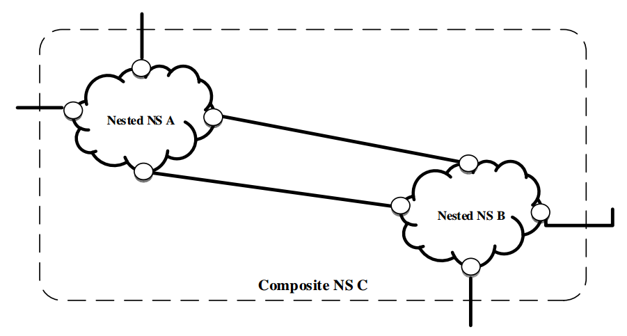
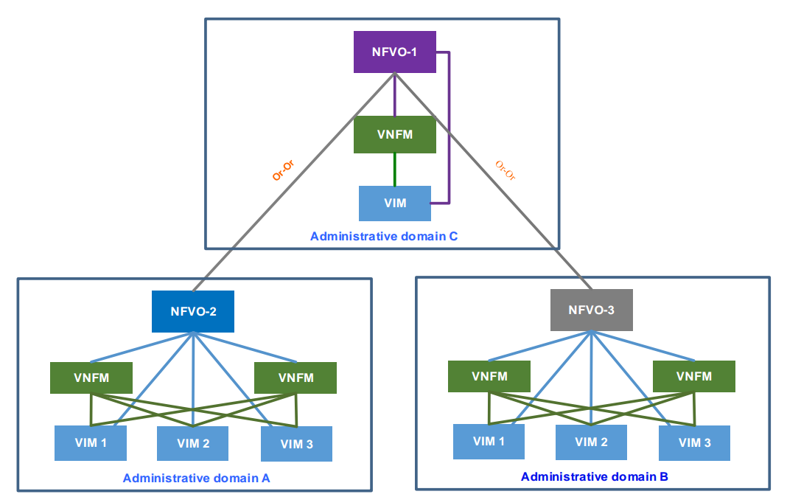
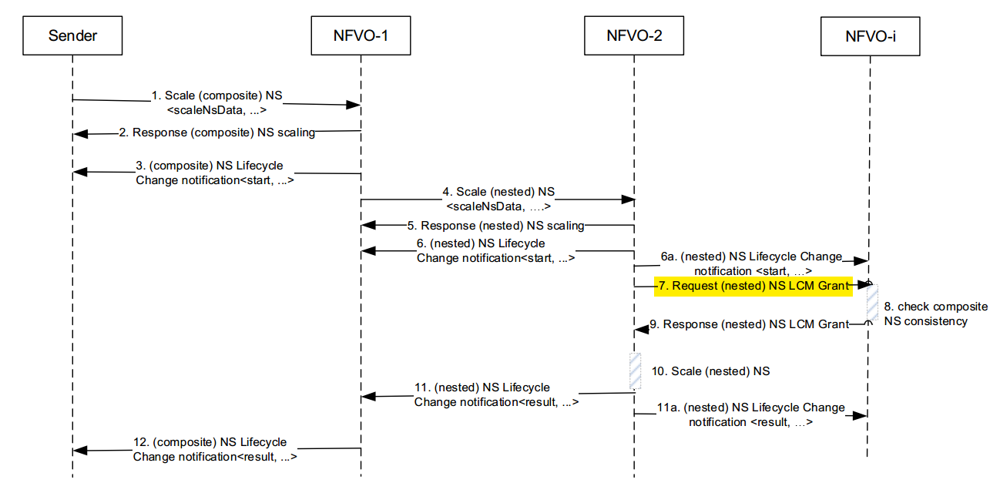

# Log related to article of causality

## 01/April/20

### Problems or triggers for reconfiguration
- Triggers
	- Energy consumption: 
		- An Energy-aware Service Function Chaining and Reconfiguration Algorithm in NFV [source](https://ieeexplore.ieee.org/abstract/document/7789440)
		- Migration Energy Aware Reconfigurations of Virtual Network Function Instances in NFV Architectures [source](https://ieeexplore.ieee.org/document/7883907)
	- Higher Revenues
		- Reconfiguration of Cloud and Bandwidth Resources in NFV Architectures Based on Segment Routing Control/Data Plane [source](https://ieeexplore.ieee.org/abstract/document/8840406/)
		- On Fast Slice Reconfiguration [source](https://ieeexplore.ieee.org/document/8648117)
	- Reduce costs
		- Proposal and Investigation of an Optical Reconfiguration Cost Aware Policy for Resource Allocation in Network Function Virtualization Infrastructures [source](https://ieeexplore.ieee.org/abstract/document/8732437)
		- Be Scalable and Rescue My Slices During Reconfiguration [source](https://hal.inria.fr/hal-02416096/document)
	- New Virtual Network Request
		- Reconfiguration of Virtual Network Mapping Considering Service Disruption [source](https://ieeexplore.ieee.org/document/6655090)
	- Improve performance of critical services
		- Coupling VNF Orchestration and SDN Virtual Network Reconfiguration[source](https://www.researchgate.net/publication/336257419_Coupling_VNF_Orchestration_and_SDN_Virtual_Network_Reconfiguration)
	- Fault tolerance 
		- Algorithms for Fault-Tolerant Placement of Stateful Virtualized Network Functions [source](https://ieeexplore.ieee.org/document/8422444)
	- Improve QoS: 
		- On Dynamic Service Function Chain Deployment and Readjustment [source](https://ieeexplore.ieee.org/document/7938396)
		- Reconfiguration de chaınes de fonctions de services sans interruption [source](https://hal.archives-ouvertes.fr/hal-02118989/file/AlgoTel.pdf)
		- On Fast Slice Reconfiguration [source](https://ieeexplore.ieee.org/document/8648117)
	- Changing loads:
		- On the Cost-Optimality Trade-off for Service Function Chain Reconfiguration [source](https://arxiv.org/abs/1910.01881)

## 02/April/20

### Network service operations [source](https://www.etsi.org/deliver/etsi_gr/NFV-REL/001_099/010/03.01.01_60/gr_NFV-REL010v030101p.pdf) ###

- Resilency Operations:
	- **Scaling**, i.e. the dynamic provisioning or deprovisioning of resources granted to VNFs;
		- violation of the forwarding graph dependencies in one (or several) VNF(s) of the network service;
		- violation of the dependencies in a nested network service (e.g. how two nested NSs are linked to each other);
		- unprotected new network service instance (e.g. failure to scale out a new pair of VNFs);
		- malfunction of old/new network service instance; etc.
		- In case the composite network service NS2 shown in Figure 6.1 has to be scaled out, if the two composite network services NS1 and NS2 do not have the same priority (e.g. one of them is more critical than the other), the higher priority composite network service needs to be served first, i.e. the scaling out process will start with its VNFs.
 	- **Migration**, i.e. the move of virtualised resources from one set of physical resources to another;
 		- maintenance purposes, e.g. NFVI software/hardware modification, servers addition/removal;
 		- service restoration following failures;
 		-  failure prevention through a deep analysis of appropriate KPIs.
 		- As a result of such a process "live migration" still may cause a detectable interruption of the VM which could
create inconsistency in the VNF if not considered and handled properly.
	 - **Restoration** following failures if resources are available;
	 	- hardware/software failures among the compute/storage resources;
	 	- loss of connectivity both locally or in a wide-area perimeter;
	 	- overload due to unusual high traffic demand (caused by a legitimate event or attacks);
	 	- failure of scaling or migration processes;
	 	- system misconfiguration;
	 	-  if several network service instances chained together are impacted by the failure, some particular instances may need to be restored before others if sequential constraints are present;
	 	- if both shared network service(s) and dedicated network service(s) are impacted by the failure, VNFs composing the shared network service(s) have to be restored first to minimize the global service unavailability;
		- if both shared network service(s) and dedicated network service(s) are impacted by the failure, VNFs composing the shared network service(s) have to be restored first to minimize the global service unavailability;
		- Handling of the restoration procedures has to take into consideration the NS instance priority attribute, therefore NFVO would prioritize accordingly the restoration of NS instances that have different levels of priority.
	 - **Resource reallocation**, i.e. restoration if the desired resources are insufficient.

### Term definition [source](https://www.etsi.org/deliver/etsi_gs/NFV/001_099/003/01.04.01_60/gs_NFV003v010401p.pdf)
- Terms
 	- **Dedicated network service:** nested network service which is only part of a single composite network service
	 - **Shared network service:** nested network service which is shared by two (or more) composite network services
 
### Network Service LCM operations [source](https://docbox.etsi.org/ISG/NFV/Open/Publications_pdf/Specs-Reports/NFV-IFA%20030v3.3.1%20-%20GS%20-%20Multi%20Domain%20MANO%20-%20spec.pdf)
- Operations 
	- **Create NS Identifier** 
	- **Delete NS Identifier**
	- **Instantiate NS**
	- Terminate NS 
	- Scale NS
	- Heal NS
	- **Query NS**
	- Subscription/Notification
	- **Get Operation Status**

Note: Operations in **bold** are the ones which do not need a grant from another orchestrator in case of multiple orchestrators [source](https://www.etsi.org/deliver/etsi_gs/NFV-SOL/001_099/011/03.03.01_60/gs_NFV-SOL011v030301p.pdf)

		
## 03/April/20
Nothing

## 04/April 20

### Definitions
**Administrative domain**: collection of systems and networks operated by a single organization or administrative authority [source](https://www.etsi.org/deliver/etsi_gs/NFV-IFA/001_099/010/02.01.01_60/gs_nfv-ifa010v020101p.pdf)

**VNF Lifecycle Operation Granting:** permission to perform a VNF lifecycle management operation and the resource management operations necessary to complete it, if any apply. [source](https://www.etsi.org/deliver/etsi_gs/NFV-IFA/001_099/010/02.01.01_60/gs_nfv-ifa010v020101p.pdf)

### Use case:  Network Services provided using multiple administrative domains [source](https://www.etsi.org/deliver/etsi_gr/NFV-IFA/001_099/028/03.01.01_60/gr_NFV-IFA028v030101p.pdf)

**Definition:** This use case describes a network operator offering Network Services (NS) to different departments within the same operator, as well as facilitating the offering of these NSs to another network operator. The use case considers a single NFVO per administrative domain.

Figure 1. Composite NS and nested NSs example. In this example, the two constituent nested NSs which build up the composite NS are offered by administrative domains different than the one offering the composite NS itself.

Figure 2. NSs hierarchy provided using multiple administrative domains.

#### NFVO-Roles

A single NFVO can play both provider consumer role. The VNFMs in each administrative domain interact with the NFVO (either NFVO-1 or NFVO-2) of the same administrative domain. NFVO-1 is not aware of the constituent VNF instances of the nested NS instance, and hence NFVO-1 does not interact with the VNFMs in the administrative domain of NFVO-2.

#### Composite NS scaling in sharing scenario

 On-boarding flows are asynchronous: i.e. no timing constraints exist between two consecutive on-boarding calls. The operational flow in this clause provides a variant scenario of composite NS scaling in which the
nested NS instance composing the composite NS instance is shared by other composite NS instances. In this scenario, when NFVO-2 receives the Scale NS request from NFVO-1, NFVO-2 further initiates corresponding granting procedure to the NFVO who manages the composite NS instance using the shared nested NS instance.

Fig 3. Composite NS scaling in sharing scenario.  It is possible that scaling on multiple layers of nested NSs can propagate across multiple administrative domains. For simplicity purpose, it is assumed that only one layer of nested NS is applied in this use case

When the NFVO-* checks the NS consistency  (e.g. dependency between the nested NS instance and other constituent of the composite NS instance it manages) which might be impacted by the nested NS scaling operation. If the composite NS consistency is guaranteed by this scaling operation, then NFVO-i approves the grant request. Otherwise, NFVO-i rejects the grant request.

## 05/April/20

### Management of Stateful NSs and VNFs [source](http:www.google.com)

- The threats are twofold:
- VNFs and NSs inconsistencies after recovery.
	- Provide mechanisms to guarantee the correct state synchronisation of VNFs and NSs.
- VNFs and NSs extended downtime due to synchronisation problem.
	- Provide support and solution in case of detecting inconsistencies.
Timing failures when the NFVO respond to a request out of time, generating inconsistencies.

Values failures when the NFVO set the wrong value in the NFV system. 

### Verification of NFV Services:

Check the consistency and safety of network service configurations on virtual and physical resources.

Network and service properties to be checked.

- Properties:
	- **Dependencies of Network Service Components:**
		- In this case, there is inconsistency between states stored and managed in VNF FGs and network tables (e.g., OpenFlow flow tables), due to communication delays and/or configuration errors. , if a VNF is replicated into the other same one for the purpose of load balance and a new FG is established through the copied one, but all the state/DBs replication is not finished yet due to delays, this can be lead to unexpected behaviors or errors of the network service. 
	- **Loop-Free in VNF FGs:**
		- In VNF FGs, a loop construction should be avoided and verified. The forwarding path over VNF FG should be checked in advance with the consideration of physical placement of VNF among NFVIs.
	- **Policy and State Consistency:**
		- Load balancing among the VNF instances is one of the most important considerations. the status in resource usage of each service node can be different and thus appropriate amount of jobs should be distributed to the VNF instances. Moreover, when VNF instances locate in physically different service nodes, simple verification of load balancing in terms of resource usage is not sufficient because different service nodes experience diverse network conditions (e.g., different levels of network congestion). 
	- **Load Balancing and Optimization among VNF Instances:**
		- In VNF FG, policy to specific users can be dynamically changed. For example, a DPI VNF can be applied only in the daytime in order to prohibit from watching adult contents while no DPI VNFs applied during the nighttime. When the policy is changed, the changed policy should be reconfigured in VNF service nodes as soon as possible. If the reconfiguration procedure is delayed, inconsistent policies may exist in service nodes. Consequently, policy inconsistency or confliction needs to be checked
	- **Performance Bottleneck:**
		- In  VNF FG, VNF instances can locate in different service nodes and these service nodes have different load status and network conditions. Consequently, the overall throughput of VNF FG is severely affected by the service nodes running VNF instances. For example, if a VNF instance locates in a heavily loaded service node, the service time at the service node will be increased. n addition, when a VNF FG includes a bottleneck link with network congestion, the end-to-end performance (e.g., latency and throughput) in the VNF FG. After detecting the bottleneck link/node, the VNF requiring scale up or down can be identified and the relocation of VNF instance among service nodes can be determined.
	- **Security Hole:**
		- In terms of security services, authentication, data integrity, confidentiality, and replay protection should be provided. In these environments, it is difficult to protect the integrity of flows traversing such VNFs.

### NFV vs. SDN [source](https://datatracker.ietf.org/meeting/92/materials/slides-92-nfvrg-3)

| NFV context (Service-level)        | SDN context (Network-level) | 
| ------------- |:-------------:| 
| Dependency of network service components (e.g., network controller vs. VNF/resource manager/orchestrator)      | No blackhole (e.g., no packet loss) | 
| Loop-free in VNF FGs (aka. service chains)  | Loop-free (e.g, routing switching)      | 
| Load balancing and optimization in VNF FGs (aka. service chains) |Flow table rule consistency between multiple applications (E.g., OpenFlow)|
| Policy and state consistency (e.g., end-toend context, virtual vs. physical resource, etc.) | Dynamic info/statistics consistency (e.g., flow, port, QoS, etc.) |
| Performance | Consistency with legacy L2/L3 protocols (e.g., STP)      |
| Security (L4-L7) | Security (L3 firewall, etc.)  |

### Split brain problem [source](http://arc.encs.concordia.ca/papers/NFVInconsistencyCloudCom.pdf)

Despite the fact that NFVO is considered as the “brain” of an NFV environment, the other managerial components can operate at each level autonomously, which is referred to as the “split-brain” issue in the literature. However, the lack of synchronization is not intended [31], and it can lead to inconsistencies whenever the states of functional elements managed by two different
managerial components differ from each other. 

